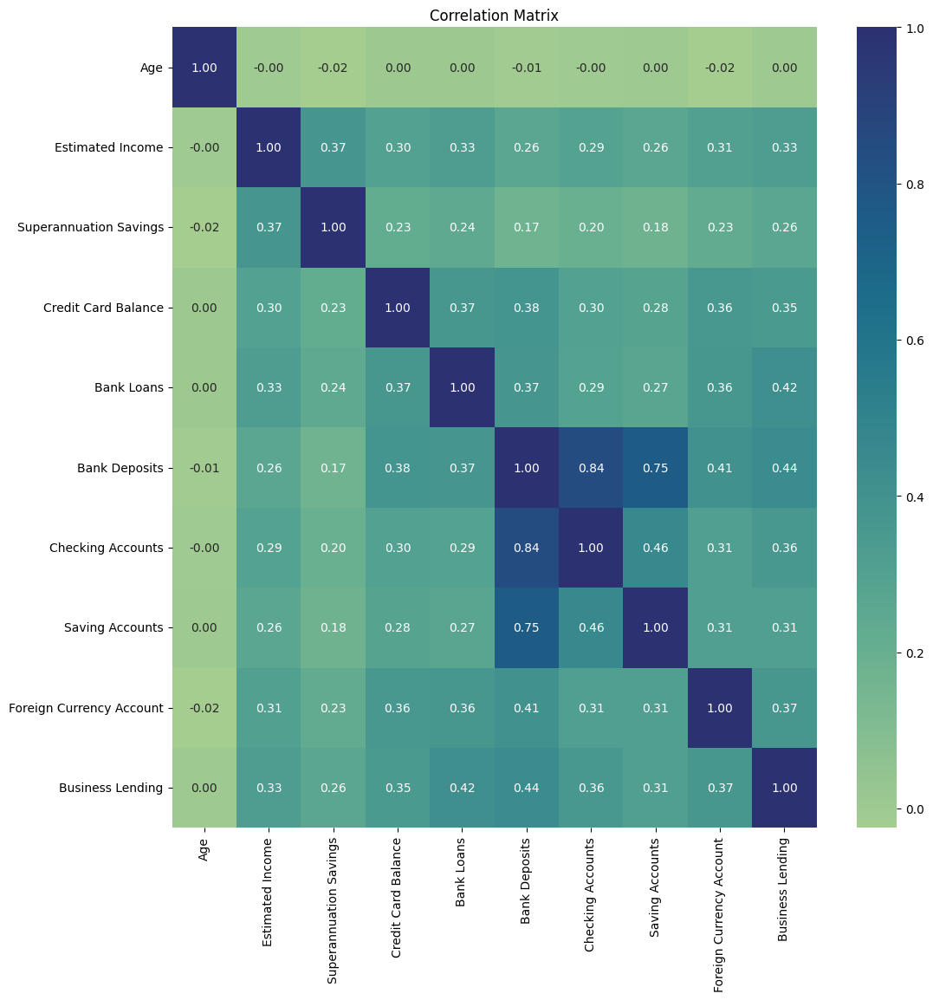
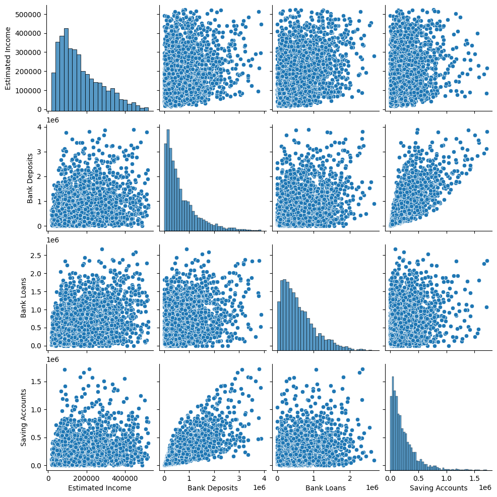
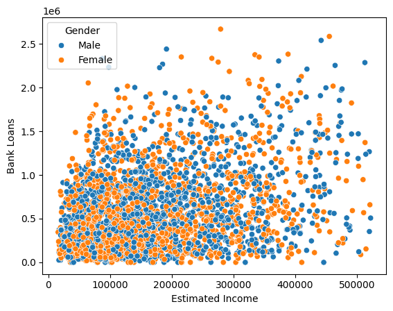
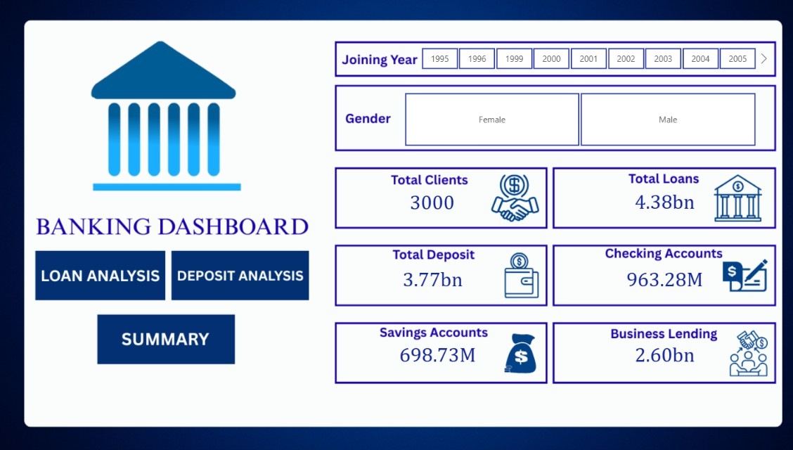

# 🏦 Bank Customer Financial Analysis & Risk Profiling Dashboard using SQL, Python & Power BI

<p align="center">


</p>

---

# 📌 Project Overview

This project presents an **end-to-end banking analytics solution** developed using **MySQL**, **Python**, and **Power BI**.

The objective of this project is to analyze customer financial behaviour, explore customer segmentation, understand existing customer risk profiles, and develop interactive dashboards that support data-driven banking decisions.

The workflow covers SQL querying, Python-based data cleaning and exploratory data analysis (EDA), and Power BI dashboard development.

---

# 🎯 Business Objective

The project aims to answer the following business questions:

- Which customer segments contribute the highest deposits?
- Which income groups have the highest loan exposure?
- How are customers distributed across different risk categories?
- Which occupations generate the highest banking business?
- What relationships exist between deposits, loans, savings, and income?
- Which customer groups are suitable for premium banking services?

---

# 🛠 Tech Stack

- **MySQL**
- **Python**
  - Pandas
  - NumPy
  - Matplotlib
  - Seaborn
- **Power BI**
- **VS Code**
- **Jupyter Notebook**

---

# 🔄 Project Workflow

```
Banking Dataset
        │
        ▼
 MySQL Database
        │
        ▼
   SQL Queries
        │
        ▼
 Data Cleaning
        │
        ▼
 Exploratory Data Analysis
        │
        ▼
 Business Insights
        │
        ▼
 Interactive Power BI Dashboard
```

---

# 🧹 Data Cleaning

The following preprocessing steps were performed:

- Removed unwanted BOM characters from column names.
- Verified missing values.
- Checked duplicate records.
- Standardized column names.
- Created Income Band feature.
- Converted Gender IDs into Male/Female labels.
- Verified data types.
- Generated descriptive statistics.

---

# 📊 Exploratory Data Analysis

The project includes:

- Univariate Analysis
- Bivariate Analysis
- Correlation Analysis
- Pair Plot Analysis
- Customer Segmentation
- Risk Distribution Analysis
- Financial Behaviour Analysis

---

# 📈 Python Visualizations

## 🔥 Correlation Matrix



### Insights

- Bank Deposits show a strong positive correlation with Checking Accounts (0.84).
- Saving Accounts are also highly correlated with Bank Deposits (0.75).
- Age has negligible correlation with other banking attributes.
- Most financial variables exhibit weak to moderate positive relationships.

---

## 📊 Pair Plot



### Insights

- Estimated Income has a moderate positive relationship with Bank Deposits.
- Customers with larger deposits generally maintain larger savings balances.
- Loan amounts are distributed across different income groups.
- No significant outliers dominate the dataset.

---

## 📈 Estimated Income vs Bank Loans



### Insights

- Customers across all income groups have bank loans.
- Male and Female customers exhibit similar borrowing behaviour.
- No significant gender-based differences are observed in loan allocation.

---

# 📊 Power BI Dashboard

The project contains four interactive dashboard pages.

---

# 🏠 Home Dashboard



### Dashboard Features

- Total Clients
- Total Loans
- Total Deposits
- Savings Accounts
- Checking Accounts
- Business Lending
- Interactive Navigation

---

# 💰 Loan Analysis Dashboard


### Dashboard Highlights

- Loan KPIs
- Business Lending Analysis
- Loan Distribution by Income Band
- Loan Distribution by Occupation
- Loan Distribution by Nationality
- Credit Card Balance Analysis

---

# 💳 Deposit Analysis Dashboard


### Dashboard Highlights

- Deposit KPIs
- Deposit Distribution by Income Band
- Deposit Distribution by Occupation
- Deposit Distribution by Nationality
- Savings Account Analysis
- Checking Account Analysis

---

# 📈 Summary Dashboard


### Dashboard Highlights

- Total Clients
- Average Income
- Total Loans
- Total Deposits
- Loan-to-Deposit Ratio
- Average Credit Card Balance
- Average Risk Weighting
- Deposits vs Loans Across Income Bands
- Customer Distribution by Income Band
- Customer Distribution by Risk Category
- Risk Distribution Across Income Bands

---

# 📊 SQL Analysis

SQL was used for:

- Data Retrieval
- Aggregation
- Filtering
- Grouping
- Sorting
- Customer Segmentation
- Banking Summary Statistics

Sample analyses include:

- Total Customers
- Average Income
- Total Loans
- Total Deposits
- Loans by Occupation
- Deposits by Nationality
- Average Income by Risk Weighting

---

# 🔍 Key Insights

- Most customers belong to the **Medium Income** segment.
- Income distribution is positively skewed with fewer high-income customers.
- Medium-income customers contribute the largest share of deposits and loans.
- Bank Deposits have strong relationships with Checking and Saving Accounts.
- Customers are primarily concentrated in lower to medium risk categories.
- Age has minimal influence on financial variables.
- Existing risk classifications enable customer segmentation for business planning.
- High-income customers represent opportunities for premium banking products.

---

# 💼 Business Recommendations

- Offer premium banking products to high-income customers.
- Improve customer segmentation using financial behaviour.
- Promote investment and retirement products to financially stable customers.
- Monitor customer portfolios based on existing Risk Weighting.
- Use dashboard insights to improve customer relationship management.

---

# 📊 Dashboard KPIs

- Total Clients
- Average Estimated Income
- Total Loans
- Total Deposits
- Average Credit Card Balance
- Average Risk Weighting
- Loan-to-Deposit Ratio

---

# 🚀 Skills Demonstrated

- SQL
- Data Cleaning
- Data Wrangling
- Exploratory Data Analysis
- Data Visualization
- Business Analytics
- Customer Segmentation
- Power BI Dashboard Development
- Financial Data Analysis
- Insight Generation

---

# 📁 Repository Structure

```
Bank-Customer-Financial-Analysis
│
├── Images
│   ├── home.jpg
│   ├── Bnking dashboard-images-1.jpg
│   ├── Bnking dashboard-images-2.jpg
│   ├── Bnking dashboard-images-3.jpg
│   ├── output.png
│   ├── output2.png
│   └── output3.png
│
├── Banking.csv
├── Data_cleaning.ipynb
├── 02_EDA.ipynb
├── bank_queries.sql
├── Bnking dashboard.pbix
└── README.md
```

---

# 📌 Future Improvements

- Predictive Credit Risk Modeling
- Loan Default Prediction
- Customer Churn Analysis
- Customer Lifetime Value Analysis
- Real-Time Dashboard Integration

---

# 📚 Conclusion

This project demonstrates a complete banking analytics workflow using MySQL, Python, and Power BI. It provides meaningful insights into customer financial behaviour, income segmentation, banking product usage, and existing customer risk profiles. The interactive dashboards support data-driven decision-making and effective customer segmentation for banking operations.

---

# 👩‍💻 Author

**Ankita Paul**

Electrical Engineering Undergraduate  
National Institute of Technology Agartala

⭐ If you found this project useful, please consider giving this repository a star.
